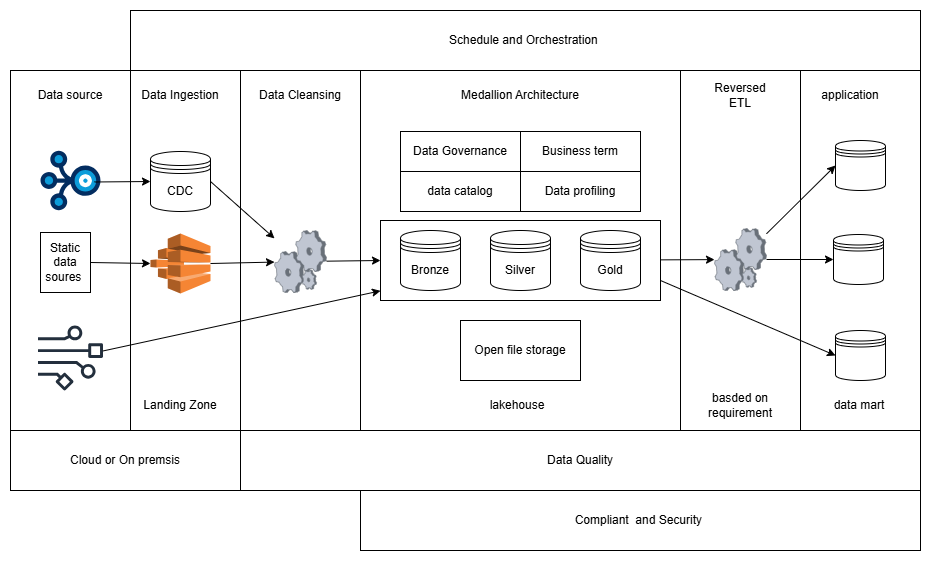
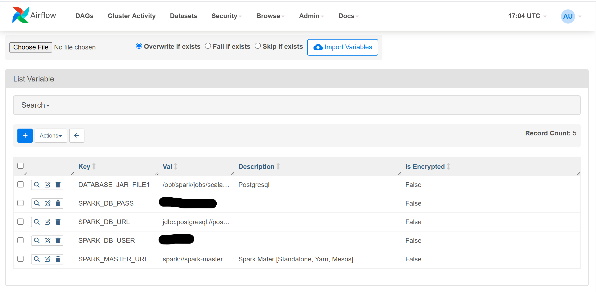
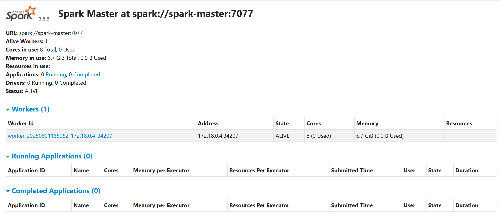
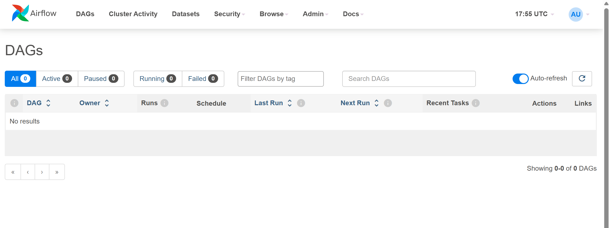
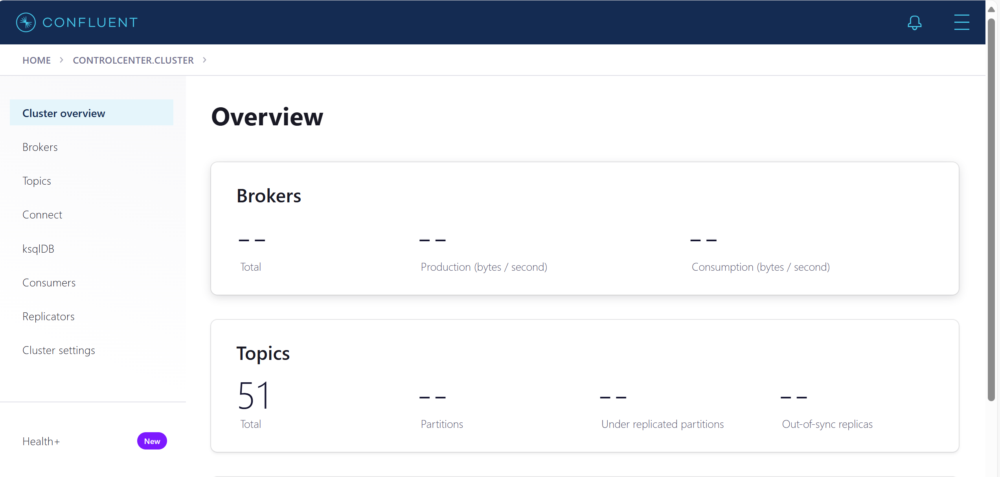
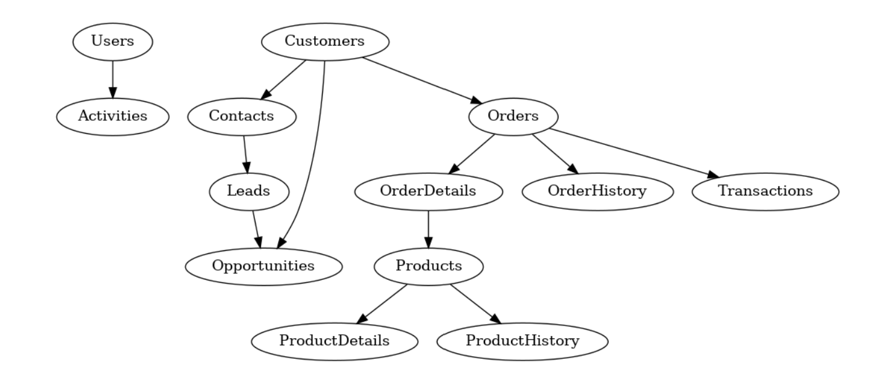
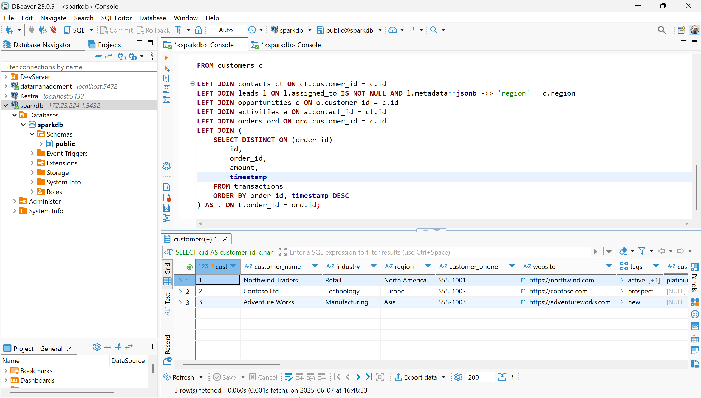
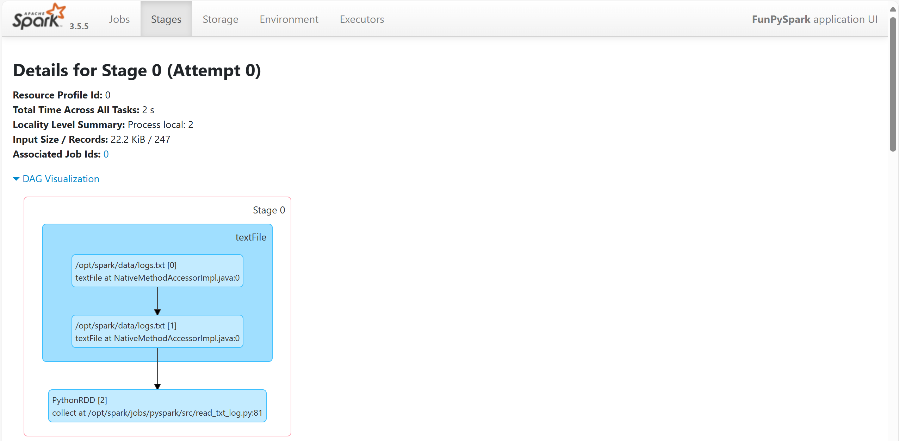

#  data engineering in Scala, PySpark 

  Data engineering needs complex infrastrucre setup and install huge dependencies to run a single pipeline. However, thanks to containerization, we can build similar setup for the DEV, QUA and PRD environment. This setup is test to run the Scala, Pyspark in low cost method. This repo also accept to use the ad-hoc query to run in juypter notebook.
  All the scripts and code are easy to test and run in local before submit to cloud server.  

# Data Pipeline Architecture


# SYSTEM Requirement 
- GNU Linux or WSL 2
- Docker must be installed 
- docke compose must be installed 
- RAM 16 GB at least 
- CPU core i5 at least 

# Languages 
- Python, PySpark 
- Scala 
- SQL 

# Framework 
- Apache Spark 
- Apache Airflow 
- Jupyter notebook / Lab for analysis

# Database 
- Postgresql 15

# Additional requirements
- Vscode with Metal extension 
- DBeaver 
- Docker for Desktop 
- Git 

# Version alignment 

| # | language | version | 
|:-:|:-------:|:------------| 
| 1 | python  | 3.12.9 | 
| 2 | Java | open-jdk-11 | 
| 3 | Scala | 2.12.18 | 

Note: All the spark server and worker use spark-3.5.5 version 

# Using make command 

| # | command | description | 
|:-:|:-------:|:------------| 
| 1 | make build | build docker images for customized spark and jupyter | 
| 2 | make up | up all docker images and need to wait 2 to 3 mins| 
| 3 | make down | docker compose down | 
| 4 | make rebuild | rebuild the docker image | 
| 5 | make clean | clean all docker image | 
| 6 | make dev | enter the spark master | 
| 7 | make da | enter the jupyter image | 
| 8 | make pg | enter the postgresql | 
| 9 | make web | enter airflow webserver | 
|10 | make scheduler | enter aiflow scheduler | 
|11 | make redis | enter redis queue | 

# Environment file 
Remove sample from the file and edit the reqiured file such as 
user name, password etc 

| # | environment file | use file name |description | 
|:-:|:----------------:|:-------------:|:-----------:|
| 1 | sample.env | .env |  environment file for jupyter notebook and postgresql | 
| 2 | sample.env.spark | .env.spark | spark environment file | 
| 3 | sample.env.airflow | .env.airflow |airflow environment file |  

REMARK: edit and make sure the parameters before image  build and docker compose up 

# Folders Description 
| # |  Folder |description | 
|:-:|:-------:|:-----------:|
| 1 | asserts | pictures folder | 
| 2 | confs | spark configuration file | 
| 3 | dags | apache airflow dags file folder | 
| 4 | data | data folder for spark and pyspark script | 
| 5 | data-modeling | for data modeling |
| 6 | data-platfrom | next comming IaC | 
| 7 | dbt | data build tool for tranformation and analytics |  
| 8 | docker | docker files location | 
| 9 | init-sql | sql related folders | 
| 10 | logs* | auto generate from apache airflow| 
| 11 | notebooks | location for data analysis and data scientist | 
| 12 | pg_data* | auto generate and volumn mount for postgresql | 
| 13 | plugins | Apache Airflow plugins file here | 
| 14 | reports | report generators | 
| 15 | result-jar| jar files collection and use in spark-submit | 
| 16 | sap-data | sample sap data from Kaggel | 
| 17 | spark-apps| scala and python development folder | 
| 18 | spark-logs| external log folder for spark| 


REMARK: Don't run make rebuild or make clean. It will take more tike to build a docker image and repulling the required images. 

# Buinses Domain 
- SAP (SD, FICO, COPA) and 
- Salesforce (CRM)
- Data catalog and data lineage 


# BUILD and Setup 
## BUILD 
Run those command in GNU Linux or WSL terminal  
```shell 
make build 
make up 
```
it needs to wait couple of minutes to build and settle the images. 

## Setup 
1. postgresl for data and  
2. apache airflow

### postgresql setup
Enter the postgresql image by `make pg` to create airflow user name and password

### psql command to enter the postresql 
```
psql -U sparkuser -d sparkdb
```
### load data to SQL
```sql 
\i /path/to/07_dml_seed_crm_orders.sql
```
### create and insert all seed values in pg using init.sh 
Remark: init.sh is in the sql_scripts folder
```
./init.sh 
```
### Airflow setup

```sql
-- Create a new database for Airflow
CREATE DATABASE airflowdb;

-- Create a new user with a secure password
CREATE USER airflow WITH PASSWORD 'airflowpass';

-- Grant privileges to the new user
GRANT ALL PRIVILEGES ON DATABASE airflowdb TO airflow;

-- change to airflowdb 
\c airflowdb

-- Grant privileges to public schema to airflow 
GRANT ALL ON SCHEMA public TO airflow;
```

- Run this command to initialize apache airflow webserver `make airflow-init-db` and then run other left commands 
```Shell 
make airflow-migrate 
make airflow-create-user
```
Airflow is ready to use, but all the example dags are not shown as development environment. 

### Airflow CLI commands 

| # | cli | description | 
|:-:|:---:|:-----------:|
|1| airflow dags list | list all dags | 
|2| airflow dags list-runs --dag-id <dag_id> | show the running dags status | 

### Airflow operator use in this project

- Spark 
- Kakfa 
- Bash 
- dbt 

### Airflow variables setup 


# Login pages 
This project supports to use UI
1. Spark master UI 
2. Spark work 
3. Spark history 
4. Jupyter notebook 
5. airflow web UI 

## Check the spark master UI in web
After building the docker images and up the process, check the spark UI

| # | url | Description | 
|:-:|:---------------------:|:------------:|
| 1 | http://localhost:8080 | spark master | 
| 2 | http://localhost:8081 | spark worker | 
| 3 | http://localhost:18080| spark histoircal server | 
| 4 | http://localhost:8088 | airflow web ui | 
| 5 | http://localhost:4040 | spark application | 
| 6 | http://localhost:8888 | Jupyter UI | 
| 7 | http://localhost:9021 | Kafka control UI | 


REMARK: Jupyter needs to use access token each time 
TODO: username and password based login 
TODO: add SSL for for secure in production deployment  

e.g. of Spark UI 



## Apache airflow integration 
This project use the Apache airflow as a data orchestrator. It supports to run spark-submit and others jobs.  
e.g. of airflow UI 


## Kafka Control center
For streaming data 


## Debezium connection 
- To run connect CDC postgresql 

```JSON
curl -X POST http://localhost:8083/connectors \
  -H "Content-Type: application/json" \
  -d '{
    "name": "pg-connector",
    "config": {
      "connector.class": "io.debezium.connector.postgresql.PostgresConnector",
      "database.hostname": "postgres",
      "database.port": "5432",
      "database.user": "youruser",
      "database.password": "yourpass",
      "database.dbname": "yourdb",
      "database.server.name": "pgserver",
      "plugin.name": "pgoutput",
      "slot.name": "debezium_slot",
      "publication.name": "debezium_pub",
      "table.include.list": "public.your_table"
    }
  }'
```

## DBT (data build tool)
```shell 
make dbt-shell 
```

in the shell start this 
```shell 
dbt init sap_landing
```

## Sample ER diagarm
This is the sample ER diagram of Old ORM system without having a proper columns name. 


### create the sigle view in postgresql 
This is the sample of single view in postgresql before deploy on the Scala code. 
It can only check for Monolithic application. 
SQL pipeline make sure the micro services into a single landing like a monolithic structure. 


# Scala and Python 
This section is about how to build the scala based application and submit the jar to spark server. In this project, we can build our jar file on server instead of using host machine. But, in real production environment we should build on provided machine for safety. 

### Software lifecycle 
- DEV, create the jar file and run on this dockers 
- QUA QA test, This is very difficult to check the Data As A Product 
- UAT, This is also difficult to do in DAAP 
- PRD, Use the Jar file and integrate with Airflow 

### Data lifecycle 
- DEV, get the sample dataset from production [Note: not use dummy data]
- QUA, check the data quality, data drift, schema evolution, and report dashboard 
- UAT, internal check and run with production data and check on the clone dashboard 
- PRD, Use the pass Jar file or python script to run on server 


### Installation in development environment 
  - Install Java [open-jdk-11]
  - Install cs 
  - Install Scala using cs [scala 2.12.18]
  - Install Python 3.12.9 
  - install sbt 
Check the sbt version 

### Scala apps [spark-apps]
  - Create a folder structure as follow in your local machine 
  - create a spark folder in `/opt/spark/job/scala`

#### create required folders 
```shell 
mkdir -p spark-apps/pyspark
mkdir -p spark-apps/scala 
mkdir -p spark-apps/scala/lib spark-apps/scala/src
```
#### create a build file 
- add the required dependencies in build.sbt
```shell 
name := "oldSingleViewCRM"

version := "0.1"

scalaVersion := "2.12.18"

// libraryDependencies += "org.apache.spark" %% "spark-core" % "3.5.0"

libraryDependencies ++= Seq(
 "org.apache.spark" %% "spark-core" % "3.5.5" % Provided,
  "org.apache.spark" %% "spark-sql"  % "3.5.5" % Provided,
  "org.scalatest"    %% "scalatest"  % "3.2.17" % Test ,
  "org.postgresql" % "postgresql" % "42.7.1" % Runtime
)
```

#### Folder structure 
```Shell 
  .
├── pyspark
│   ├── README.md
│   ├── src
│   │   └── read_txt_log.py
│   └── test
└── scala
    ├── build.sbt
    ├── lib
    │   └── postgresql-42.7.1.jar    
    └── src
        ├── main
        │   └── scala
        │       ├── oldSingleViewCRM.scala
        │       ├── readPg.scala
        │       └── readTxtLog.scala
        └── test
            └── readTxtLogTest.scala
```

###  Build the jar file 
using make dev and do the following steps 
```shell 
cd /opt/spark/jobs/scala
sbt package 
```

### output jar location 
The path contains the output of sbt compiler 
```
/opt/spark/jobs/scala/target/scala-2.12
```
### copy jar file to spark server
if the jar file build in host or local machine copy jar file and submit to spark  server. 
Change the Jar file location in spark-submit, Following spark-submit is only for creating a jar file in the spark server. 

### Jar file submit 
    This process needs to do in the master node and run this command 
```shell 
/opt/spark/bin
```
Then run the spark-submit to get the result
```shell 
spark-submit \
  --class readTxtLog \
  --master spark://spark-master:7077 \
  --conf spark.input.path=/opt/spark/data/logs.txt \
  --conf spark.log.type=INFO \
  --conf spark.interface.name=VTLINK \
  /opt/spark/jobs/scala/target/scala-2.12/sparkrdd_2.12-0.1.jar
```
### Pyspark submit
To test with PySpark 
```shell 
PYSPARK_DRIVER_PYTHON=python3 spark-submit \
  --master spark://spark-master:7077 \
  --conf spark.input.path=/opt/spark/data/logs.txt \
  --conf spark.log.type=INFO \
  --conf spark.interface.name=VTLINK \
  /opt/spark/jobs/pyspark/src/read_txt_log.py
```

# Troubleshooting 
### Check the defautl route to interactive with DBeaver 
```shell 
ip route | grep default 
```
The Sample output is -> default via 172.23.224.1 dev eth0 proto kernel 

### Postgresal connection to DBeaver and check for single view
Add the requried data to connection and use the default IP addess get from the ip route, in this case the jdbc connecting is using 172.23.224.1 this ip address

### Spark submit fail 
- Build Scala version and Spark server Scala version mismatch 
- File path 
- Postgresql user name and password 
- postgresql jdbc connector location issue 

### Debezium connector checking 
```bash
curl http://localhost:8083/connector-plugins
```
Remark: it needs to run double to get the response from server 

if the above command is not reply anything check with this command 
```bash 
docker exec -it debezium curl http://localhost:8083/connector-plugins
```


### Kafka cannot write log 
```bash 
sudo chown -R 1000:1000 ./kafka-data
sudo chmod -R 755 ./kafka-data
```

### Debezuim connector type 
- Avro 
- Json 


# check the process in UI
we can check the spark process in UI and it is also a dag.  




# Log retention 
- delete the log after 15 days 

# Data compliance
- General Data Protection Regulation (GDPR) 
- Health Insurance Portability and Accountability Act (HIPAA) 
- Payment Card Industry Data Security Standards (PCI-DSS)

# Business values 
- Same report for OLD CRM system is monolithic and some are running in Mirco service 
- Real time data analysis support
- Data As A Product 
- Compliant checking using AI
- report generation in pdf and in excel 
- ON DEMANd ad-hoc report supprot 
- Master data management 
- SAP and Salesfoce data as simple [SD, FICO, MW and MM ]
- SAP in lakehouse sample and lineage 

# Next plan 
- Add MINIO for object storage 
- Add Openlineage for data lineage 
- Add Openmetadata for Metadaa 
- Full ETL pipeline in Scala 
- DataVault 2.0 and SCD type 2 for address and historical tracking 
- CI/CD 
- Data profiler 
- Integration with Apache Iceberg 
- ELK stack for indexing and Enterprise search

